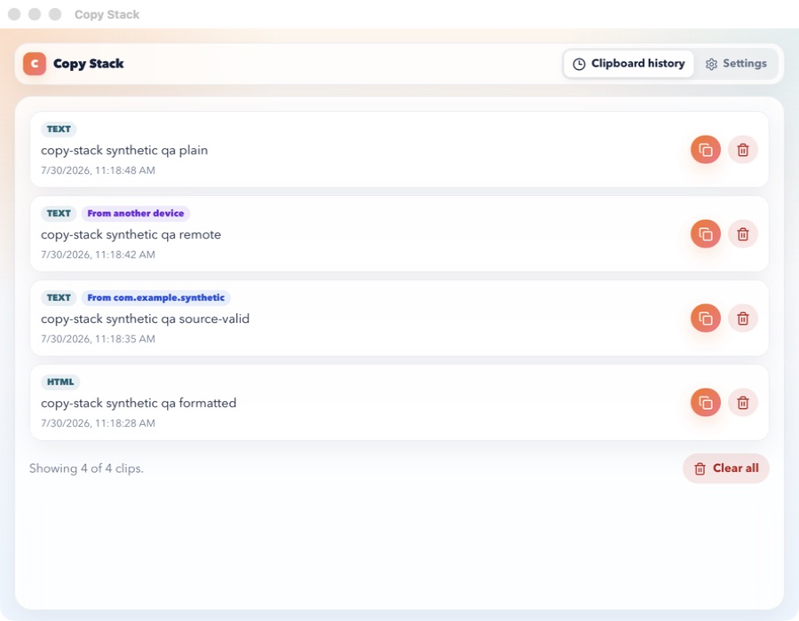
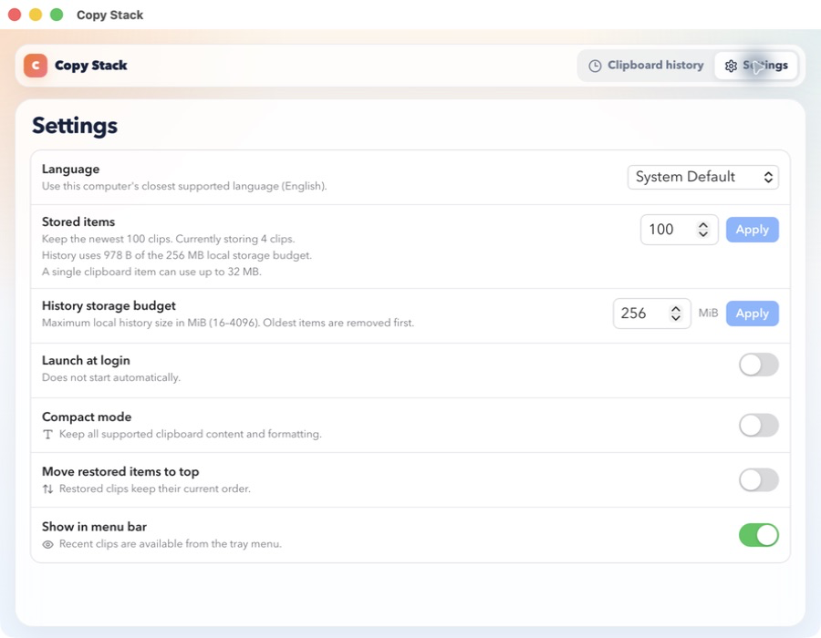

<p align="center">
  
</p>

<h1 align="center">Copy Stack</h1>

<p align="center">
  A private, native-feeling clipboard history for macOS, built with Tauri, React, and Rust.
</p>

Copy Stack runs quietly in the menu bar, records eligible clipboard content in
a local SQLite database, and lets you restore recent items without sending
clipboard data to a remote service.

## Screenshots

| Clipboard history                                                                                 | Settings                                                    |
| ------------------------------------------------------------------------------------------------- | ----------------------------------------------------------- |
|  |  |

> Every clipboard item shown in these screenshots is synthetic QA data.

## Highlights

- **Fast history:** loads summaries in bounded pages and fetches rich previews
  only when an item is expanded.
- **Rich clipboard support:** handles text, formatted text, images, files,
  folders, and bounded media metadata.
- **Quick restore:** restores an item from either the History page or the macOS
  menu bar.
- **Private by default:** stores accepted content locally and gives database,
  sidecar, and optional mirror files private permissions.
- **Clipboard-aware filtering:** excludes transient, auto-generated,
  concealed, and supported password-manager content before persistence.
- **Storage controls:** enforces configurable item and byte limits and includes
  an optional text-only compact mode.
- **Native lifecycle:** supports single-instance activation and opt-in launch
  at login.
- **Localized UI:** supports English, Simplified Chinese, and Traditional
  Chinese, including system-language detection.

## Requirements

- macOS
- Node.js 18 or newer
- pnpm 10
- Rust stable
- Xcode Command Line Tools

## Run From Source

```bash
git clone https://github.com/vdpw/copy_stack.git
cd copy_stack
corepack enable
pnpm install
pnpm desktop:dev
```

The development app uses the real macOS pasteboard. For isolated manual QA,
follow the temporary-data workflow in
[`docs/development.md`](docs/development.md).

## Build

```bash
pnpm desktop:build
```

The Tauri bundle is written below `src-tauri/target/release/bundle/`. Current
builds are ad-hoc signed and are not notarized; see
[`docs/release.md`](docs/release.md) before distributing an artifact.

## How It Works

```text
macOS pasteboard
      │
      ▼
copy_event_listener
      │  classify, normalize, filter
      ▼
Rust / Tauri backend ──► SQLite history
      │                       │
      ├──► menu bar           └──► optional atomic JSONL mirror
      │
      ▼
React History + Settings
```

History order, deduplication, retention, and restore behavior are persisted in
SQLite rather than simulated in React. The frontend requests 50 bounded
summaries at a time, while rich HTML and media detail is loaded on demand.

## Privacy Notes

The default database is:

```text
$HOME/.copy_stack/copy_stack.db
```

The data directory is restricted to the current user, but clipboard history is
not encrypted at rest. Anyone who can access your macOS account may be able to
read it. Concealed/password-manager, transient, and auto-generated pasteboard
items are skipped before they reach the database, tray, diagnostics, or JSONL
mirror.

The optional JSONL mirror may contain accepted clipboard bodies. Treat it with
the same care as the database and never attach either file to a bug report
without reviewing and sanitizing it.

## Development Commands

| Command                                            | Purpose                                               |
| -------------------------------------------------- | ----------------------------------------------------- |
| `pnpm desktop:dev`                                 | Run the React frontend inside the Tauri desktop shell |
| `pnpm dev`                                         | Run the Vite frontend only                            |
| `pnpm type-check`                                  | Type-check the frontend                               |
| `pnpm lint`                                        | Lint TypeScript and React                             |
| `pnpm test`                                        | Run frontend tests                                    |
| `pnpm build`                                       | Build the frontend                                    |
| `pnpm security-check`                              | Verify security configuration guardrails              |
| `cargo check --manifest-path src-tauri/Cargo.toml` | Check the Rust backend                                |
| `cargo test --manifest-path src-tauri/Cargo.toml`  | Run Rust tests                                        |

The documentation index at [`docs/index.md`](docs/index.md) links to the
architecture, frontend, backend, persistence, performance, security, and
release guides. [`AGENTS.MD`](AGENTS.MD) is the compact project menu for coding
agents.

## Project Layout

```text
copy_stack/
├── src/                  React and TypeScript frontend
│   ├── features/         History and Settings
│   ├── hooks/            Paging, detail cache, and settings state
│   ├── api/              Typed Tauri invocation boundary
│   └── lib/              Display and HTML-preview safety helpers
├── src-tauri/            Rust backend and Tauri configuration
│   └── src/
│       ├── store/        SQLite, classification, paging, and previews
│       ├── tray.rs       macOS menu-bar integration
│       └── lib.rs        Commands and application lifecycle
├── scripts/              Synthetic QA and performance helpers
└── docs/                 Design and development documentation
```

## Platform Status

Copy Stack currently targets macOS. Windows assets are generated for Tauri
packaging compatibility, but Windows clipboard behavior is not implemented or
supported.

## Contributing

Before opening a pull request, run the checks appropriate for your change from
[`docs/development.md`](docs/development.md). Clipboard fixtures, screenshots,
logs, and databases must contain synthetic data only.

## License

Copy Stack is available under the [MIT License](LICENSE).
