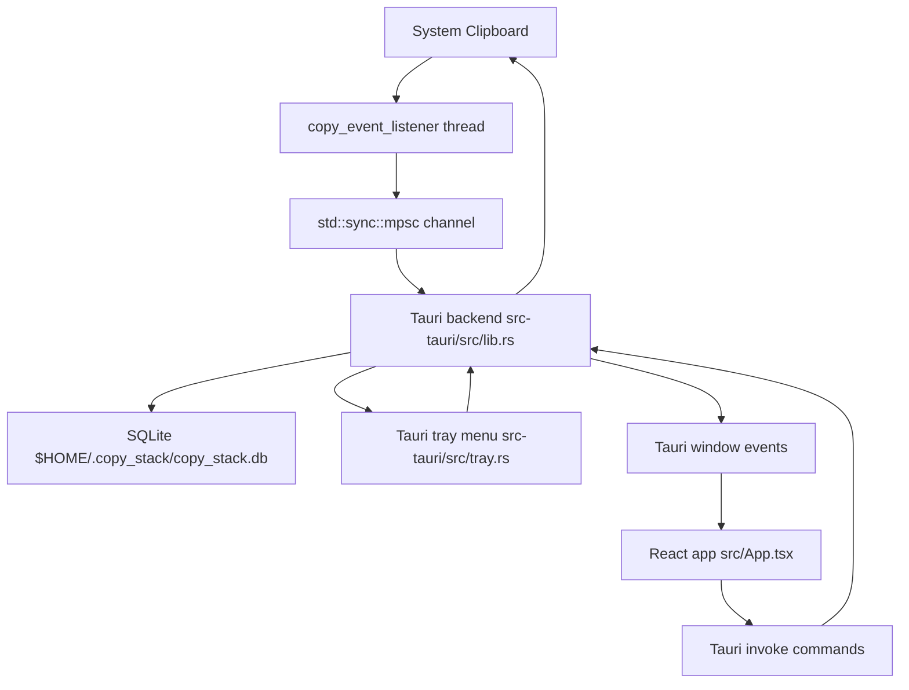

# Architecture

## Component Map



## Runtime Lifecycle

1. `src-tauri/src/main.rs` creates an `mpsc` channel.
2. `main.rs` starts a clipboard listener thread using
   `ClipboardListener::new().with_interval(500)`.
3. The listener sends captured `copy_event_listener::event::Event` values to
   the backend over the channel.
4. `copy_stack_lib::run(rx)` starts the Tauri runtime.
5. `src-tauri/src/lib.rs` initializes SQLite, shared app state, startup cleanup,
   the tray menu, and a thread that consumes clipboard events from `rx`.
6. The React frontend mounts, calls `get_copy_events` and `get_app_settings`,
   and subscribes to backend events.

## Backend State

The Tauri app stores shared state in `AppState`:

- `db: Mutex<Database>` owns a `rusqlite::Connection`.
- `pending_restore_suppression: Mutex<Option<PendingRestoreSuppression>>`
  prevents app-initiated clipboard restores from being captured back into
  history when restore ordering should be preserved.

The database connection is serialized through the mutex. Any command that reads
or mutates history or settings locks `state.db`.

## Frontend Boundary

The frontend uses Tauri APIs only through:

- `invoke(...)` from `@tauri-apps/api/core`
- `listen(...)` from `@tauri-apps/api/event`

The important frontend files are:

- `src/main.tsx`: mounts React.
- `src/App.tsx`: owns UI state, invokes Tauri commands, listens for backend
  events, decodes stored clipboard payload previews, and renders History and
  Settings.
- `src/App.css`: responsive layout and visual styling.

## Backend Boundary

The important backend files are:

- `src-tauri/src/main.rs`: starts clipboard monitoring and launches Tauri.
- `src-tauri/src/lib.rs`: Tauri setup, app state, command handlers, listener
  event persistence, restore suppression, and command registration.
- `src-tauri/src/store/database.rs`: SQLite path, schema initialization,
  migrations, settings, content hashing, dedupe, ordering, and retention.
- `src-tauri/src/tray.rs`: tray setup, tray menu reconstruction, tray actions,
  menu labels, and Tauri frontend notifications.
- `src-tauri/tauri.conf.json`: window, build, bundle, and icon configuration.

`src-tauri/src/event/` contains older standalone event structs. The active
clipboard storage path uses `copy_event_listener::event::Event`.

## Command Contract

Commands registered in `tauri::generate_handler!` are callable from React:

- `get_copy_events`
- `delete_copy_event`
- `clear_all_events`
- `copy_to_clipboard`
- `get_event_by_id`
- `get_app_settings`
- `set_max_items`
- `set_show_in_menu_bar`
- `set_move_restored_item_to_top`

When adding, removing, or renaming a command, update both the Rust handler list
and all frontend `invoke(...)` calls.

## Event Contract

Backend-to-frontend events are emitted from `src-tauri/src/tray.rs`:

- `clipboard-history-updated`: frontend reloads history from `get_copy_events`.
- `app:navigate`: frontend switches to `history` or `settings`.

The current frontend does not consume `new-copy-event`.

## History Ordering

Ordering is a backend and database concern. The UI renders rows in the order
returned by `get_copy_events`. SQLite returns rows with:

```sql
ORDER BY sort_order DESC, timestamp DESC
```

Do not implement a separate frontend-only ordering rule unless the database
contract also changes.

## Restore Suppression

Restoring a saved item writes to the system clipboard. The listener can observe
that write as a new clipboard event. When `move_restored_item_to_top` is false,
the backend queues a content hash for up to five seconds and skips the matching
listener event once. This preserves the item's current order while still writing
the clipboard.

When `move_restored_item_to_top` is true, restore operations update the row's
`sort_order` and `timestamp`, sync the tray, and notify the UI.

## Failure Boundaries

- Clipboard listener errors are outside the current app-level error model.
- Tauri command errors are returned as `String` and usually logged only in
  development mode on the frontend.
- Database schema initialization runs on startup and can mutate existing data to
  rebuild hashes, remove duplicates, and backfill ordering.
- Tray sync failures are logged in debug builds and can leave the visible tray
  stale until the next successful sync.
