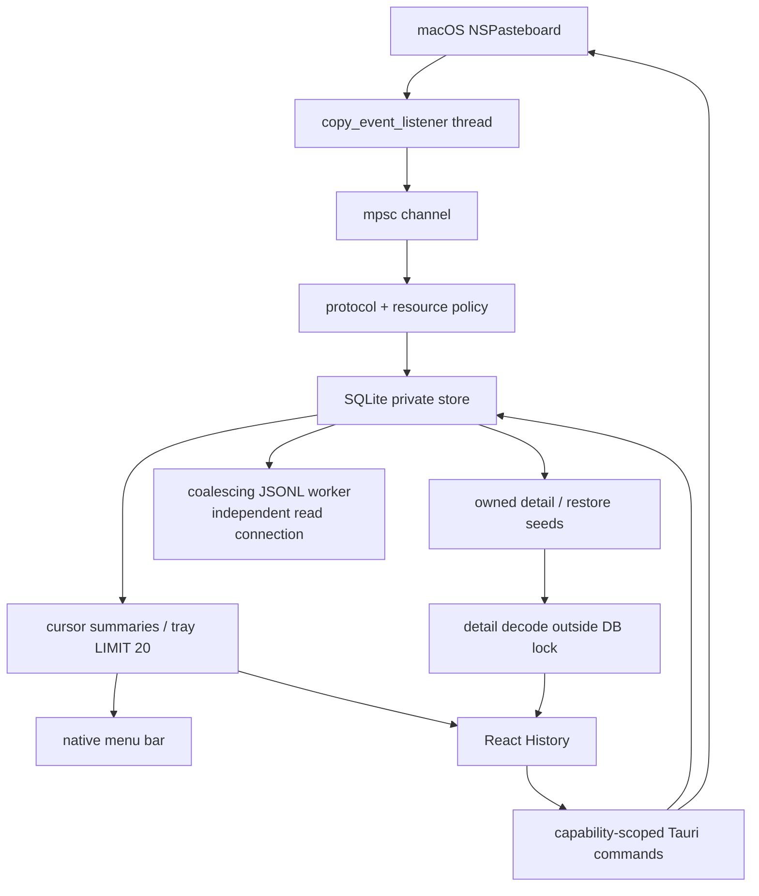

# Architecture

## Component Map


```mermaid
flowchart TD
  OS["macOS NSPasteboard"] --> Listener["copy_event_listener thread"]
  Listener --> Channel["mpsc channel"]
  Channel --> Policy["protocol + resource policy"]
  Policy --> DB["SQLite private store"]
  DB --> Summaries["cursor summaries / tray LIMIT 20"]
  DB --> Seeds["owned detail / restore seeds"]
  Seeds --> Detail["detail decode outside DB lock"]
  DB --> Mirror["coalescing JSONL worker<br/>independent read connection"]
  Summaries --> Tray["native menu bar"]
  Summaries --> UI["React History"]
  Detail --> UI
  UI --> Commands["capability-scoped Tauri commands"]
  Commands --> DB
  Commands --> OS
```

## Runtime Lifecycle

1. `main.rs` parses project startup flags and calls `run(startup_options)`.
2. The Tauri builder registers `tauri-plugin-single-instance` before every
   other plugin. A later process asks the first process to show, unminimize, and
   focus its main window, then exits before app setup.
3. The autostart plugin is registered with the internal
   `--copy-stack-autostart` argument. Autostart remains off until the user
   enables the operating system login item.
4. First-instance setup applies the launch visibility policy. Manual launches
   show the main window; login launches keep it hidden.
5. Setup opens the private SQLite database, applies only required transactional
   schema/classifier migrations, and runs count/byte retention.
6. If requested by startup flags, setup starts the JSONL worker and schedules a
   row-free refresh after cleanup; the worker reads committed rows on its own
   connection.
7. Setup creates managed state, localized native menus, the menu bar, and the
   clipboard listener and storage threads.
8. On application exit, the JSONL worker is asked to flush its latest
   generation and stop within two seconds. A timeout is recorded as a redacted
   diagnostic rather than blocking exit indefinitely.

A current `PRAGMA user_version` and classifier metadata version take the fast
path: startup validates schema/index shape but does not decode, reclassify, or
rewrite every history row.

## Backend State

`AppState` contains:

- `db: Mutex<Database>`: one `rusqlite::Connection`;
- `pending_restore_suppression`: one short-lived content identity used to
  ignore the listener echo of an app restore;
- `history_mirror: Option<HistoryMirror>`: the background JSONL scheduler and
  worker;
- `diagnostics: DiagnosticLog`: at most 32 redacted diagnostic records.

Database access remains serialized, but expensive work is separated from the
lock:

- list and menu queries select only persisted summary columns;
- detail and restore commands copy an owned seed under the lock, then decode
  event data and inspect media after releasing it;
- JSONL refresh signals are sent after a committed mutation. One coalescing
  worker reads the latest rows through an independent read-only connection,
  then decodes, serializes, flushes, syncs, and atomically renames them.

## Frontend Structure

- `src/App.tsx`: chooses the `main` or `settings` surface and coordinates
  language/error presentation.
- `src/features/history/`: history list, cards, media presentation, and the
  bounded detail cache.
- `src/features/settings/`: settings presentation.
- `src/hooks/useClipboardHistory.ts`: 50-item cursor paging and refresh
  generation control.
- `src/hooks/useHistoryDetails.ts`: on-expansion detail loading.
- `src/hooks/useAppSettings.ts`: authoritative settings/autostart reads and
  optimistic mutation rollback.
- `src/api/tauri.ts`: typed command invocation and safe error normalization.
- `src/lib/htmlPreview.ts`: allowlist sanitizer and isolated preview document.
- `src/types.ts`: the TypeScript side of serialized Rust contracts.

The main window keeps scroll and expansion state across live refreshes. The
settings window loads counts and byte totals from `get_app_settings`; it does
not fetch clipboard history.

## Command Contract

Registered commands are:

- history window: `get_copy_events_page`, `get_history_detail`,
  `delete_copy_event`, `clear_all_events`, `copy_to_clipboard`,
  `get_app_settings`, and `get_safe_diagnostics`;
- settings window: `get_app_settings`, `get_safe_diagnostics`,
  `get_autostart_status`, `set_autostart_enabled`, `set_max_items`,
  `set_max_history_bytes`, `set_show_in_menu_bar`,
  `set_move_restored_item_to_top`, `set_compact_mode`, and `set_language`.

`src-tauri/capabilities/main.json` and `settings.json` grant these commands per
window. The settings window cannot query history or details, and the main
window cannot mutate autostart. There is no broad `core:default` grant and the
unused opener plugin is not installed.

## Event Contract

- `clipboard-history-updated`: reload the first history page while preserving
  view state.
- `app:navigate`: show History when the native menu requests it.
- `app-language-changed`: reload settings so all webviews use the backend's
  resolved language.
- `capture-rejected`: show a localized notice for a resource-limit rejection;
  the payload contains only a resource code and size bucket.

The app does not use `new-copy-event`.

## Ordering And Paging

History is ordered by:

```sql
ORDER BY timestamp DESC, content_hash ASC
```

The opaque `v1` cursor contains the last row's timestamp and lowercase content
hash. Subsequent pages use the same tuple comparison, avoiding offset drift and
handling equal timestamps deterministically. The default page size is 50 and
the backend clamps every request to 100. The current schema has no `sort_order`
column; legacy `sort_order` is translated during migration only.

## Security Boundaries

Production CSP denies external connections and unsafe script/style execution
and disables objects, forms, base URLs, and embedding. The unused Tauri asset
protocol is disabled. Bounded local image bytes become revocable in-memory
`blob:` URLs, while video details expose only a display label and media type,
never a full local path.

HTML previews are input-, node-, and depth-bounded, rebuilt from an element and
attribute allowlist, stripped of every resource URL, placed in a sandboxed
iframe, and receive inner `default-src 'none'; img-src 'none'` policy. The outer
production policy also disallows `data:` images. Command errors expose only
stable code, operation, and retryability. Native/manual verification
requirements remain tracked in `docs/security-release-checklist.md`.
