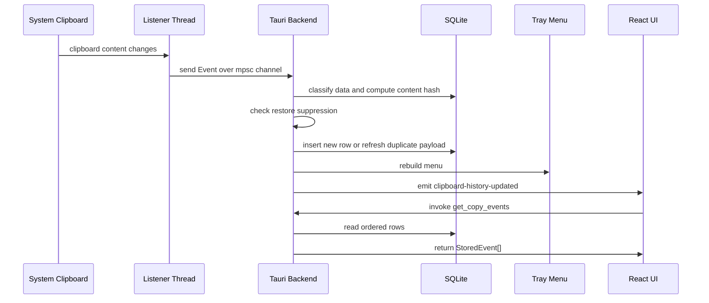
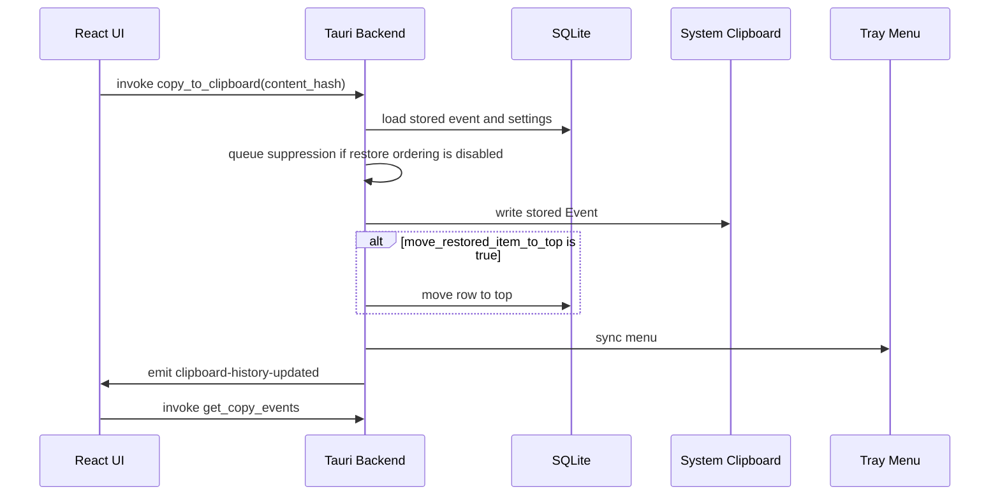

# Clipboard Event Flows

## Event Names

Backend-to-frontend events:

- `clipboard-history-updated`: history changed; frontend should call
  `get_copy_events`.
- `app:navigate`: tray requested a view; payload is `history` or `settings`.

The current app does not use `new-copy-event`.

## Capture Flow



Important rules:

- The listener polls every 500 milliseconds.
- Duplicate content updates the existing row payload and preserves its order.
- The UI reloads from SQLite instead of inserting optimistic rows.
- Tray sync runs after successful persistence.
- When the history JSONL mirror is enabled, the backend rewrites it after
  successful persistence before tray/UI refresh.

## Restore From Main Window



The frontend also calls `loadEvents()` after `copy_to_clipboard` resolves. The
backend notification keeps other UI refresh paths consistent.

## Restore From Tray Menu

The tray menu item id is `event::<content-hash>`. Selecting it runs
`restore_event(...)` in `src-tauri/src/tray.rs`.

Flow:

1. Load the stored event, content hash, and restore-order setting.
2. Queue suppression if restore ordering is disabled.
3. Write the event back to the clipboard.
4. If restore ordering is enabled, move the row to the top.
5. If ordering changed, notify the frontend and sync the tray.

When restore ordering is disabled, the code writes to the clipboard but does not
notify or sync immediately because the stored list did not change.

## Delete One Item

Frontend flow:

1. User clicks the delete button.
2. `delete_copy_event` is invoked with `{ contentHash }`.
3. Backend deletes the row.
4. Backend syncs the tray.
5. Frontend reloads history after the command returns.

Current backend behavior does not emit `clipboard-history-updated` for
`delete_copy_event`; the caller is expected to reload after the command.

## Clear All History

From the frontend:

1. User clicks Clear all.
2. `clear_all_events` deletes all rows.
3. Backend syncs the tray.
4. Frontend reloads history after the command returns.

From the tray:

1. User selects Clear history.
2. Backend deletes all rows.
3. Backend emits `clipboard-history-updated`.
4. Backend syncs the tray.

## Change Retention

Frontend flow:

1. User edits `max_items`.
2. UI validates 1 to 1000.
3. If the new limit is below the current visible count, UI asks for
   confirmation.
4. `set_max_items` stores the setting and trims old rows.
5. Backend syncs the tray.
6. Frontend reloads history after the command returns.

## Toggle Tray Visibility

Frontend flow:

1. User toggles tray visibility.
2. `set_show_in_menu_bar` stores `show_in_menu_bar`.
3. Backend syncs the tray.
4. `tray.set_visible(...)` applies the setting.

If the tray is hidden, users must reopen the main window through the Dock or the
platform shell to turn it back on.

## Toggle Restore Ordering

Frontend flow:

1. User toggles restore ordering.
2. `set_move_restored_item_to_top` stores the setting.
3. Future restore actions either move rows to the top or preserve current order.

This setting does not rewrite existing history.

## Payload Flow

Stored payloads are binary-encoded Rust values:

```text
copy_event_listener::event::Event -> binary event blob -> clipboard_events.event_data
```

The binary event blob preserves all data flavors reported by the listener,
including private or platform-specific metadata. Classification selects stable
public flavors for `content_hash`, `data_type`, and `display`; it does not
filter the persisted event payload.

The backend returns stored `data_type` and binary `display` preview metadata for
history lists without sending raw `event_data` to React. It also returns
display-only `rich_preview` segments when the stored event contains ordered
mixed text/image content. Restore operations use the backend to decode and pass
the original event back to `ClipboardListener::set_clipboard_event(...)`.

## Flow Change Checklist

- Decide whether the database order changes.
- If the order changes, update SQLite first and make the frontend reload from
  `get_copy_events`.
- If a tray action changes history, emit `clipboard-history-updated`.
- If a frontend command changes history but does not emit, reload explicitly
  after the command resolves.
- Keep restore suppression behavior intentional when writing to the clipboard.
