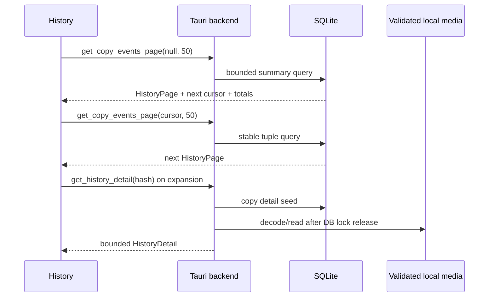

# Clipboard And History Flows

## Event Names

- `clipboard-history-updated`: refresh the first History page and settings
  totals.
- `app:navigate`: the tray requested History/Settings or the macOS application
  menu requested Settings.
- `app:focus-search`: the tray requested the History search field.
- `app-language-changed`: reload authoritative language/settings.
- `capture-rejected`: a resource-limited event could not be safely degraded;
  payload contains only resource kind and size bucket.

The app does not use `new-copy-event`.

## Capture

```mermaid
sequenceDiagram
  participant Clipboard as NSPasteboard
  participant Listener as Listener thread
  participant Policy as Protocol/resource policy
  participant DB as SQLite
  participant Mirror as JSONL worker
  participant Tray as Menu bar
  participant UI as History

  Clipboard->>Listener: Event
  Listener->>Policy: mpsc send
  Policy->>Policy: event-wide marker assessment
  alt concealed/transient/autogenerated
    Policy-->>Policy: stop without content inspection
  else accepted
    Policy->>Policy: enforce budgets/degrade safe rich event to text
    Policy->>DB: prepared upsert + retention transaction
    DB-->>Policy: committed
    Policy-->>Mirror: schedule row-free refresh
    Mirror->>DB: independent read of latest committed rows
    Policy->>Tray: coalesced summary-only rebuild (configured count; 0 = all)
    Policy->>UI: clipboard-history-updated
  end
```

Protocol assessment always precedes hashing, resource classification, compact
projection, persistence, previews, tray, and mirror export. A marker on any item
applies to the complete event.

The persisted `max_event_bytes` setting limits the complete encoded capture,
including metadata and encoding overhead (1–256 whole MiB, default 32 MiB).
Oversized rich captures can fall back to plain text only when the fallback,
including preserved markers, fits the same limit. Text, formatted content,
and images can use a larger configured capture limit; file URLs retain their
64 KiB cap and all display/preview/IPC budgets remain bounded independently.
Before upsert the current setting is checked again in case it changed while
the event was being prepared. Changing it never deletes or rewrites older
rows, which remain restorable even above the new limit.

On macOS, highlighting a text row in the open tray menu performs a separate
display-only lookup for that content hash and shows up to 64 KiB in a
nonactivating panel beside the menu. Line breaks are preserved. Moving to an
action/non-text row or closing the menu hides the panel. Menu construction
remains summary-only, and clicking the highlighted row still uses the canonical
restore path.

Accepted events are classified once before the database lock used for the
upsert. Duplicate identity updates the stored body and source/remote metadata
without moving the row or resetting its pin flag. New rows receive a monotonic timestamp. Restore
suppression is checked by content identity before capture size limits, so an
older restored item above a lowered limit does not show a rejection notice.

Mirror scheduling happens after commit. The worker coalesces row-free refresh
signals, reads the latest committed state through its own SQLite connection,
and performs decode, serialization, flush, sync, and atomic rename away from
the shared database lock. A mirror failure does not roll back the already
committed history row.

## Browse, Refresh, And Detail

```mermaid
sequenceDiagram
  participant UI as History
  participant Backend as Tauri backend
  participant DB as SQLite
  participant Media as Validated local media

  UI->>Backend: get_copy_events_page(null, 50)
  Backend->>DB: bounded summary query
  DB-->>UI: HistoryPage + next cursor + totals
  UI->>Backend: get_copy_events_page(cursor, 50)
  Backend->>DB: stable tuple query
  DB-->>UI: next HistoryPage
  UI->>Backend: get_history_detail(hash) on expansion
  Backend->>DB: copy detail seed
  Backend->>Media: decode/read after DB lock release
  Backend-->>UI: bounded HistoryDetail
```

A live update replaces the first page only if the request generation is still
current. While the window is focused, the frontend restores the previous scroll
anchor. If the update arrives while the window is unfocused, it resets to the
top after refresh so the newest item is visible on return. The expanded-hash
set remains in view state. Settings obtains `history_count` and `history_bytes`
from `get_app_settings`; it does not load History to compute them.

A nonempty search query follows the same cursor order and bounded summary path,
but joins the rebuildable FTS index across all retained rows. Search never
decodes restore payloads or reads local media. The menu bar Search action shows
History and emits `app:focus-search`; search results are then restored or deleted
through the same canonical paths as ordinary History rows. Both lists put
pinned summaries first, then sort by descending timestamp and ascending hash
within each group. The cursor carries all three ordering fields.

## Pin And Unpin

The History card action invokes `set_copy_event_pinned` with the content hash
and desired boolean state. It neither expands the card nor writes the clipboard.
The backend updates SQLite without changing the timestamp, applies retention
when unpinning, commits, schedules the mirror, rebuilds the menu, and emits
`clipboard-history-updated`. The frontend refreshes authoritative pages and
shows the new section/badge state; a failed command reports the `pin_history`
operation and only offers a retry when permitted by the error contract.

The menu gives pinned entries their own leading section and pin marker while
retaining direct-click restore and lazy hover previews. Its combined item limit
is filled with pinned entries first; Open History provides access to the rest.
Pin management stays in the main window.

## Restore From History Or Menu Bar

Both entry points:

1. read an owned restore seed and ordering setting under the database lock;
2. release the lock and decode the full or compact event;
3. remove all stored source/remote marker occurrences;
4. add exactly one source marker to the first item, using the stored exact
   UTF-8 value or an empty value when unknown;
5. add exactly one empty remote marker only when stored provenance is remote;
6. queue one-shot suppression of the app's listener echo;
7. write the prepared event to NSPasteboard.

When restore-to-top is enabled, the backend then updates the timestamp, takes
and schedules a mirror snapshot, refreshes the menu bar, and emits
`clipboard-history-updated`. The item moves to the top of its pinned or ordinary
group. When disabled, persisted history does not change
and the UI does not perform a redundant reload.

A successful pasteboard write is the restore command's terminal success point.
Failures in subsequent ordering, mirror, tray, or notification work record the
non-retryable `restore_post_processing_failed` error instead of returning a
retryable command failure that could duplicate the external write. Development
builds also emit it through the global diagnostic event; production builds do
not surface that background diagnostic as a banner.

## Delete, Clear, And Retention

History delete and Settings clear commands:

1. commit SQLite;
2. release the lock;
3. schedule a row-free mirror refresh;
4. let the mirror worker read current committed state;
5. rebuild the menu bar;
6. let History refresh after a delete, or reload Settings totals after a clear.

Clear from Settings or the tray deletes only unpinned rows. Both labels and the
Settings confirmation make this explicit. Explicit item deletion still removes
a pinned item when requested; in compact mode it removes the whole equivalent
text group. The tray clear action additionally emits
`clipboard-history-updated`.

Changing `max_items` or `max_history_bytes` stores the value, removes oldest
unpinned rows until both budgets are met or none remain, schedules the mirror,
rebuilds the menu bar, and notifies History. Pinned rows count toward totals but
survive even when they alone exceed a budget. Settings uses aggregate counts
for confirmation and explains the pin exception. Unpinning applies the same
cleanup immediately.

## Compact Mode

Protocol assessment always sees the original event. Compact capture accepts only
one valid nonblank plain-text projection and preserves dedicated source/remote
metadata. Older full rows are not rewritten: page, menu, and restore queries
project eligible rows to canonical text and hide image/file/video-dominant
rows. Rows with the same effective text appear once and are shown as pinned if
any equivalent stored row is pinned. Pin/Unpin and explicit deletion affect the
whole effective-text group. Capturing that text again consolidates the group while retaining its
newest timestamp and any pin flag. JSONL uses the compact projection and is
refreshed when the mode changes.

## Lifecycle And Autostart

A manual first launch shows the main window. An autostart launch contains the
internal `--copy-stack-autostart` flag and keeps the main window hidden while
the tray and listener run. A duplicate launch never reaches database/listener
setup; it shows, unminimizes, and focuses the first process's main window.
Closing the main window keeps the process running, and clicking the macOS Dock
icon shows, unminimizes, and focuses that existing window again.

The Settings switch reads OS state. A write is followed by read-back and a
mismatch is an error. If a frontend update fails, Settings reads the current
state again or restores its previous value.

## Failure Presentation

Tauri commands return stable `{code, operation, retryable}` errors. The UI
shows localized operation-level feedback and retry controls, never raw
database/filesystem/plugin errors. The backend diagnostic ring contains only
redacted environment and enum fields. Development builds may display those safe
fields for asynchronous debugging. Production builds neither subscribe to the
global runtime-error event nor render diagnostic JSON; startup and user-invoked
command failures retain concise localized feedback. Protocol skips remain
silent; resource rejections produce the safe `capture-rejected` notice.

## Flow Change Checklist

- Keep protocol policy first and one decision per event.
- Update SQLite before tray/UI/mirror notifications.
- Keep file/media work and mirror writes outside the database lock.
- Preserve cursor order and summary-only History/menu construction; keep tray
  hover detail lazy, display-only, and bounded.
- Use the shared canonical restore helper for both entry points.
- Update Rust/TypeScript contracts, permissions, capabilities, and docs
  together.
